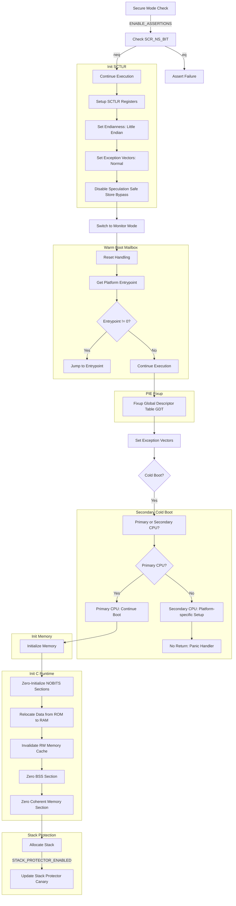

```mermaid
graph TD

    A[Secure Mode Check] -->|ENABLE_ASSERTIONS| B[Check SCR_NS_BIT]

    B -->|eq| C[Assert Failure]

    B -->|neq| D[Continue Execution]

  


    subgraph _init_sctlr [Init SCTLR]

        D --> E[Setup SCTLR Registers]

        E --> F[Set Endianness: Little Endian]

        F --> G[Set Exception Vectors: Normal]

        G --> H[Disable Speculation Safe Store Bypass]

    end

  

    H --> I[Switch to Monitor Mode]

    I --> J[Reset Handling]

  


    subgraph _warm_boot_mailbox [Warm Boot Mailbox]

        J --> K[Get Platform Entrypoint]

        K --> L{Entrypoint != 0?}

        L -->|Yes| M[Jump to Entrypoint]

        L -->|No| N[Continue Execution]

    end

  

    subgraph _pie_fixup_size [PIE Fixup]

        N --> O[Fixup Global Descriptor Table GDT]

    end

  

    O --> P[Set Exception Vectors]

    P --> Q{Cold Boot?}

    Q -->|Yes| R[Primary or Secondary CPU?]

  


    subgraph _secondary_cold_boot [Secondary Cold Boot]

        R --> S{Primary CPU?}

        S -->|Yes| T[Primary CPU: Continue Boot]

        S -->|No| U[Secondary CPU: Platform-specific Setup]

        U --> V[No Return: Panic Handler]

    end

  


    subgraph _init_memory [Init Memory]

        T --> W[Initialize Memory]

    end

  


    subgraph _init_c_runtime [Init C Runtime]

        W --> X[Zero-Initialize NOBITS Sections]

        X --> Y[Relocate Data from ROM to RAM]

        Y --> Z[Invalidate RW Memory Cache]

        Z --> AA[Zero BSS Section]

        AA --> AB[Zero Coherent Memory Section]

    end

  

    AB --> AC[Allocate Stack]

  


    subgraph Stack Protection

        AC -->|STACK_PROTECTOR_ENABLED| AD[Update Stack Protector Canary]

    end
```